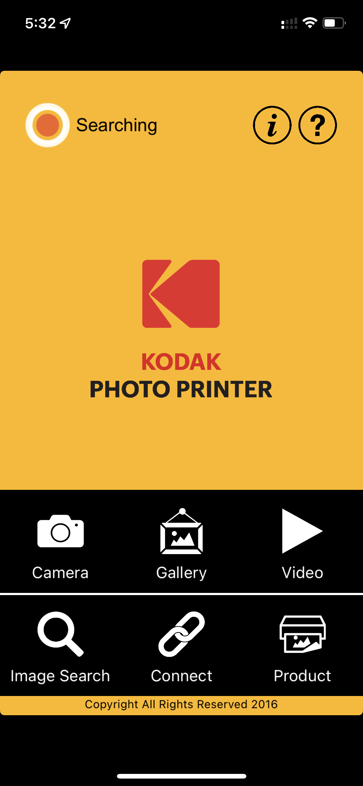
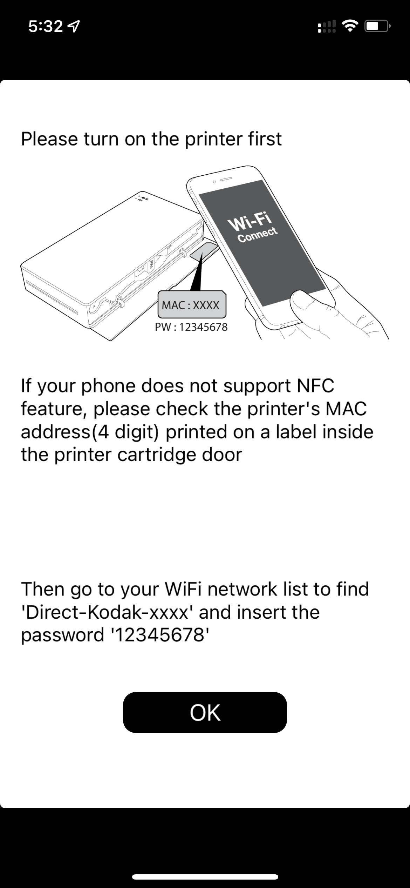
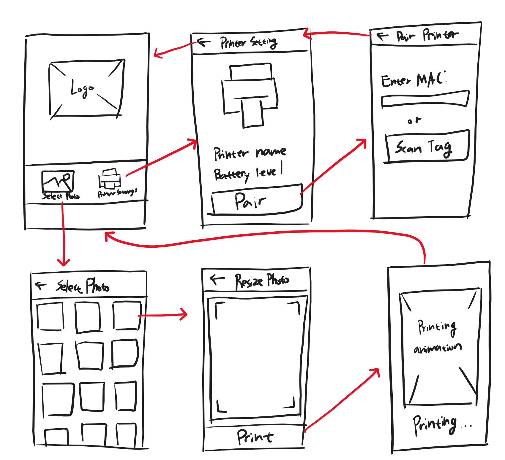

# Prinics

## Motivation

I own a Kodak Photo Printer Mini which is a portable photo printer that connects to smartphones and allow users to print their photo on the fly. While the companion app of the printer does what it supposed to do, the process of getting a photo printed out is not user-friendly. I think there is a lot of room to improve the user experience of the companion app and I can create a better version of it.

## Things that can be improved

### UI

The original companion app doesn't support the screen sizes of latest iOS devices. As the app includes features to edit photos, having more screen estate would be appreciated by the users.

### The way the app connects to a printer

The original companion app requires users to go to device's settings and connect to the printer's WIFI. Not only this process is cumbersome, users will loose the internet connection as the printer's WIFI is not connected to the internet.  
Because iOS apps can request the system to connect/disconnect to/from a WIFI network, it would be better to save the printer's WIFI information and actually connect to the printer only when user requests to print a photo or see status of the printer.  
Furthermore, the printer has an built in NFC tag containing its WIFI information. It would be better for users to tap the printer with their phone and get connected right away without trying to find the WIFI information printed inside the cartridge door of the printer.

### The way users select photos to print

If a user wants to print a photo with the original companion app, the photo has to be stored in the photo album of the device. And if the user has storage optimization turned on, the photos that are not downloaded from iCloud would not show up in the app.  
The new app should be able to seamlessly work with the latest features of iOS.
It would be a great addition if the new app implements a share sheet extension so that users can print a photo with out saving it to the photos app. (e.g. printin a photo they got on a messenger app)

## New companion app

### Must-have features

 - [ ] Saving a printer's WIFI information
 - [ ] Connecting to the printer whenever needed
 - [ ] Selecting a photo from the photo library
 - [ ] Cut photo into appropriate aspect ratio for printing
 - [ ] Printing a photo

 ### Good to have features

 - [ ] Nice UI
 - [ ] Reading printer's NFC tag
 - [ ] Share sheet extension
 - [ ] Photo editor

 ## Wireframe of the main features

 